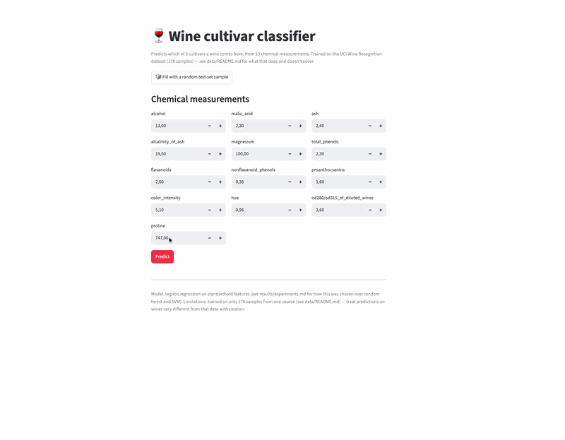
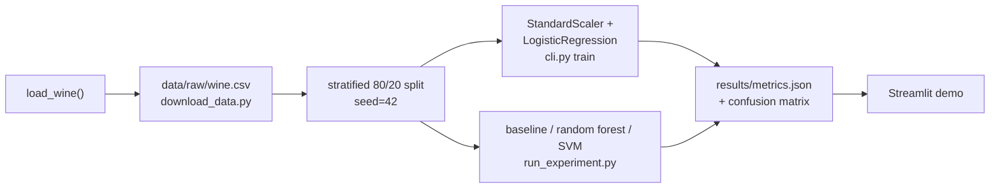
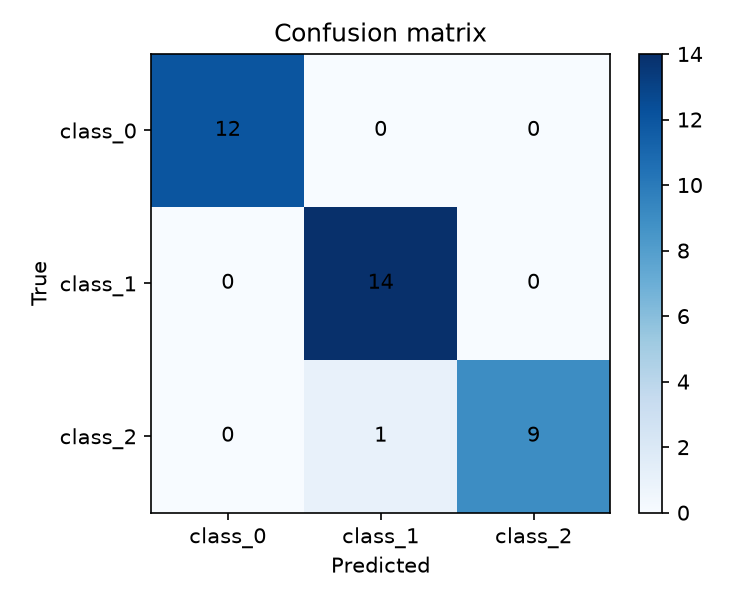

# 🍷 wine-origin-classifier

Predicts which of 3 grape cultivars a wine came from, using 13 chemical measurements — a small, complete, fully-reproducible example project built from [`ucu-ai-course/project-template`](https://github.com/ucu-ai-course/project-template).


> [!note]
> This repo is **both** a GitHub Template (click "Use this template" to get a clean, working starting point for your own semester project) **and** a fully filled-in example (this exact repo trains a real model and produces real numbers — nothing here is a placeholder). See §"Repository structure" for what to replace with your own project's content.

## Demo

`streamlit run app/streamlit_app.py` (see [`app/README.md`](app/README.md)) launches the demo below: enter 13 chemical measurements (or click "fill with a random test-set sample"), get a predicted cultivar and class probabilities.



## Team

| Name | GitHub | Role |
|---|---|---|
| Oleksandr Kosovan | [@OleksandrKosovan](https://github.com/OleksandrKosovan) | Data pipeline, modeling, evaluation |
| Slavko Prytula | [@SlavkoPrytula](https://github.com/SlavkoPrytula) | CLI, Streamlit app, CI/CD |

## Problem and motivation

Wine composition is routinely measured in a lab (alcohol content, phenols, color intensity, and so on), but the cultivar a bottle actually comes from isn't always recorded reliably further down the supply chain. This project asks a narrow, checkable question: given only the chemistry, can a simple model recover the cultivar? It's a deliberately small, well-understood problem — the point of this repository is to demonstrate a complete, reproducible ML project structure end to end, not to push the state of the art on wine chemistry.

## Data

178 samples, 13 numeric chemical features, 3 balanced-ish classes, sourced from the UCI Wine Recognition dataset via `sklearn.datasets.load_wine`. No missing values, no personal data, no licensing restrictions beyond standard academic citation. Full data card, schema, and checksum: [`data/README.md`](data/README.md).

> [!note] Why this matters: data isn't part of this git repo
> `data/`, like `models/`, is gitignored. Committing raw data bloats the repo forever (`git rm` doesn't remove history — see `data/README.md`), makes diffs unreadable, and often runs into licenses that don't actually permit redistribution. Instead, `data/raw/CHECKSUMS.txt` **is** committed — a few bytes that let anyone verify they regenerated the exact same data, without the data itself ever touching git.

## Approach



Baseline (`DummyClassifier`) → primary model (`StandardScaler` + `LogisticRegression`) → comparison model (`RandomForestClassifier`) → a fourth model we tried and rejected (`SVC`, default hyperparameters). See [`results/experiments.md`](results/experiments.md) for the full comparison, including the rejected run.

## Results

Test set (36 held-out samples) and 5-fold cross-validation, seed=42. Generated by `python scripts/run_experiment.py` on 2026-08-09; reproduce with `make reproduce` (prints the primary model's numbers) or `python scripts/run_experiment.py` (full table below).

| Model | Test accuracy | Test macro-F1 | CV accuracy (mean ± std) |
|---|---|---|---|
| Baseline (most-frequent class) | 0.389 | 0.187 | 0.399 ± 0.015 |
| **Logistic regression (selected)** | 0.972 | 0.971 | **0.983 ± 0.014** |
| Random forest (200 trees) | 1.000 | 1.000 | 0.978 ± 0.021 |
| SVM, default hyperparameters — *rejected* | 0.694 | 0.558 | 0.674 ± 0.040 |



> [!note] Why this matters: a metric without a baseline row means nothing
> "97% accuracy" sounds great until you notice the majority class alone is ~40% of the test set — at which point 97% is either impressive or barely-better-than-guessing, and you can't tell which without the baseline row above. Report it every time, not just when it's flattering.

> [!note] Why this matters: one seed isn't a conclusion
> Look at the table above: random forest scores *higher* on the single test split (1.000 vs 0.972) than logistic regression — but logistic regression wins on 5-fold CV, both on the mean **and** with a lower std. With only 36 test samples, one flipped prediction moves accuracy by ~2.8 points — enough to flip a ranking that a single split would have gotten wrong. That's why we selected the model on CV numbers, not the test-set numbers. Full writeup: [`results/experiments.md`](results/experiments.md).

## Quick start

```bash
git clone <repo-url> && cd wine-origin-classifier
make setup                          # creates .venv, installs deps, installs pre-commit hooks
make reproduce                      # data -> train -> evaluate; should print accuracy=0.9722 macro_f1=0.9710
source .venv/bin/activate           # everything past this point assumes the venv is active
streamlit run app/streamlit_app.py  # opens the demo at localhost:8501
```

> [!important]
> `make setup` uses `python3.13` by default (`PYTHON=python3.13` in the `Makefile`) — if that's not on your `PATH`, either install it or run `make setup PYTHON=python3.11` (3.11+ works fine, this project has no 3.13-only dependency).
>
> `setup` and `reproduce` are the only two `Makefile` targets — deliberately, as a small example of the pattern rather than a wrapper around everything. Every other command in this README (training, the demo, linting, tests) is run directly; see "Development" below.

### Tooling is this template's default, not a course requirement

This repo uses `pip` + `flake8` + `black` + `isort` because that's the lowest common denominator most students already know. Nothing about the course methodology requires exactly this — a `uv` + `ruff` setup (faster, less config) is a perfectly fine substitute, and what's graded is that your environment is reproducible and your code is consistently formatted, not which tool you used to get there. If you switch, it's about this much code:

```bash
uv venv && uv pip install -r requirements.txt -r requirements-dev.txt
ruff check . && ruff format --check .
```

## Repository structure

```
.
├── src/wine_origin/     # the package: config, data, models, evaluate, cli.py (the single entry point)
├── scripts/              # download_data.py, run_experiment.py
├── app/                  # streamlit_app.py — the interactive demo (see app/README.md)
├── notebooks/             # 01-04, executed, narrative-first (see notebooks/README.md)
├── tests/                 # test_data.py, test_models.py, test_reproducibility.py
├── config/default.yaml    # every hyperparameter, path, and the seed — nothing hardcoded in src/
├── data/                  # raw data NOT committed; data/README.md (data card) IS
├── models/                # trained weights NOT committed; models/README.md (HF Hub instructions) IS
├── results/               # metrics.json + experiments.md + figures/ — all committed, all small
├── docs/                  # proposal/, poster/, slides/, CONTRIBUTING.md, and this file's supporting docs
└── .github/workflows/     # lint.yml — one CI example, easy to extend (see its comments)
```

Everything above (except the placeholders in `docs/proposal|poster|slides/`) is real, executed, working content — clone it and run it, don't take our word for it.

## Reproducibility

- **Seed**: `42`, set once in `config/default.yaml`, applied via `wine_origin.utils.set_seed()` to both `random` and `numpy`.
- **Versions**: Python 3.13.14; see `requirements.txt` for pinned package versions. Every run's exact versions + OS + git commit are captured by `wine_origin.utils.env_info()` and written into `results/metrics.json`'s `env` field — that's what "reproducible" is checked against, not just claimed.
- **OS tested on**: macOS (arm64) locally; `.github/workflows/lint.yml` also runs on Ubuntu (`ubuntu-latest`) on every push — add a `test.yml` alongside it the same way if you want CI to run `pytest` too, not just lint.
- **Runtime**: `make reproduce` takes well under a minute on a laptop — no GPU needed, no dataset download beyond what's bundled in scikit-learn.
- **Known limitations**: 178 samples total means wide uncertainty on any single metric — see the CV std columns in the results table, and treat any one number with the same caution `results/experiments.md` applies to the random-forest test-set score.

> [!note] Why this matters: a seed alone isn't reproducibility
> Fixing the seed makes a run *repeatable* on your own machine. It's `env_info()` — capturing exact library versions, OS, and the git commit — that makes it *reproducible* somewhere else, months later, when a library's default behavior has quietly changed underneath an unpinned dependency.

## Development

```bash
flake8 src/ scripts/ tests/ app/ && black --check src/ scripts/ tests/ app/ && isort --check src/ scripts/ tests/ app/  # what CI runs
black src/ scripts/ tests/ app/ && isort src/ scripts/ tests/ app/                                                     # auto-fix formatting
pytest                                                                                                                  # full suite runs in under a second
```

Pre-commit hooks (installed by `make setup`) catch most of this before you even open a PR — see `.pre-commit-config.yaml`.

> [!note] Why this matters: CI enforces it instead of "we agreed to"
> "The team agreed to run black before committing" survives about one deadline-week skip before someone's code silently stops matching. A red `lint` check in CI is unambiguous, and — importantly — **a red CI check blocks merging**: reviewing a PR you can't tell has passed its own tests is a bad use of a reviewer's time, so don't merge over red CI, fix it first.

## AI usage

| Tool | Used for | How the result was checked |
|---|---|---|
| GitHub Copilot | Autocomplete while writing `src/wine_origin/evaluate.py` | Read line by line; covered by `tests/test_reproducibility.py` and `tests/test_models.py` |
| ChatGPT | Explaining the difference between macro- and micro-averaged F1 before choosing which to report | Cross-checked against the scikit-learn docs for `f1_score` |
| Claude | First draft of this README's prose | Rewritten by hand; every number was replaced with the actual value from `results/metrics.json`, not left as generated |

**What we didn't delegate:** the model-selection decision itself (§Results) — specifically, noticing that the single-split ranking disagreed with the cross-validated ranking, and choosing to trust CV — was made by reading the actual numbers, not accepted from a tool's suggestion. Any hyperparameter or architecture choice that ended up in `config/default.yaml` was verified by rerunning `python scripts/run_experiment.py` ourselves, not taken on faith.

## Contribution statement

| Member | Contribution | Responsible for |
|---|---|---|
| Oleksandr Kosovan | 50% | `src/wine_origin/` (data, models, evaluate), `scripts/run_experiment.py`, notebooks 01–03, tests |
| Slavko Prytula | 50% | `cli.py`, `app/streamlit_app.py`, CI workflow, `docs/`, notebook 04, this README |

Both members agree with the above distribution.

## License and citation

| | License | Notes |
|---|---|---|
| Code (this repo) | MIT — see [`LICENSE`](LICENSE) | Free to reuse, including commercially |
| Data | See [`data/README.md`](data/README.md) | **Not MIT** — the dataset's own terms apply, independent of this repo's code license |
| Trained model | Inherits the data's terms + this repo's code license | See [`models/README.md`](models/README.md) |
| Text / poster / slides | CC BY 4.0 (recommended) | Attribute this repo if reused |

> [!important] Why this matters: MIT on the repo does not cover the data
> The single most common licensing mistake in student projects: assuming an MIT `LICENSE` file at the repo root means *everything* in the repo — including any data you collected or redistributed — is under that license. It doesn't. Code and data are licensed independently; check both.

Citing this project: see [`CITATION.cff`](CITATION.cff) (GitHub renders a "Cite this repository" button from it automatically). Citing the underlying dataset: see [`data/README.md`](data/README.md).

## Acknowledgments

Built from [`ucu-ai-course/project-template`](https://github.com/ucu-ai-course/project-template). Thanks to the course instructors and our project mentor for feedback throughout the semester.
